# smartthings-intercom

## Installation Steps

1. [Custom Device Handler installation](./#custom-device-handler-installation)
2. [SmartApp installation](./#smartapp-installation)
3. [Server Installation](./server)
4. [add smartapp to your location using phone application or web portal](./#added-smartapp-to-your-location)

## Custom Device Handler installation
1. open [https://graph.api.smartthings.com/location/list](https://graph.api.smartthings.com/location/list)
2. select your location 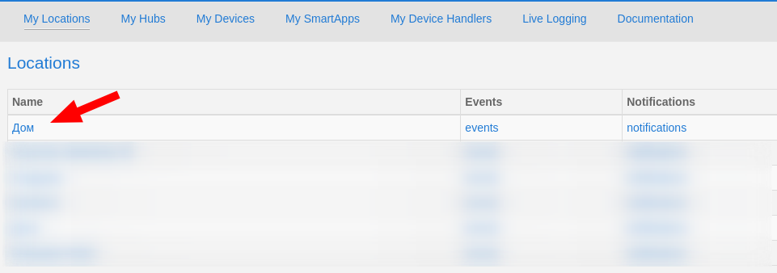
3. select "My Device Handlers" 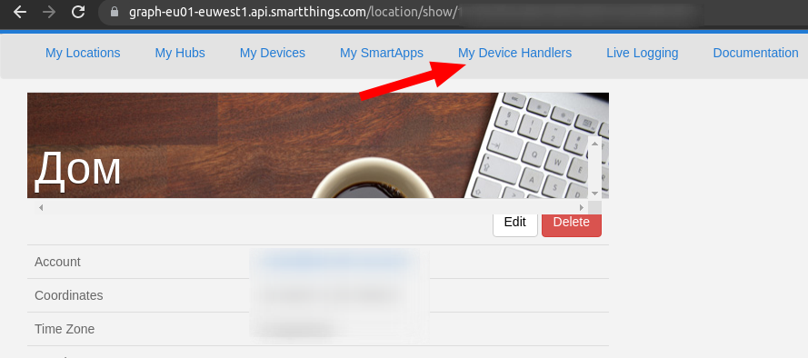
4. create a new device handler from the [dht/Intercom.groovy](./dht/Intercom.groovy) 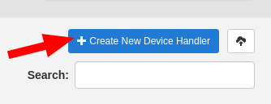 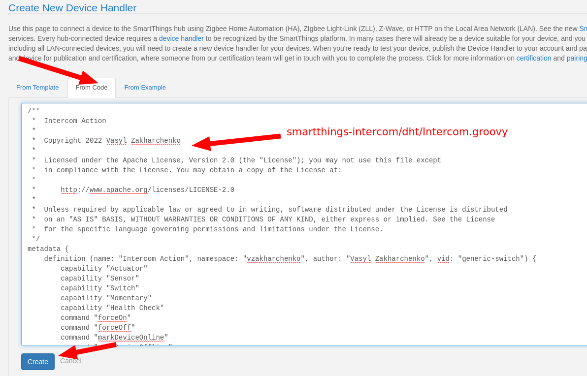
5. publish "For Me" 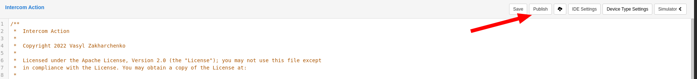

## SmartApp installation
1. open [https://graph.api.smartthings.com/location/list](https://graph.api.smartthings.com/location/list)
2. select your location 
3. select "My Smartapps" 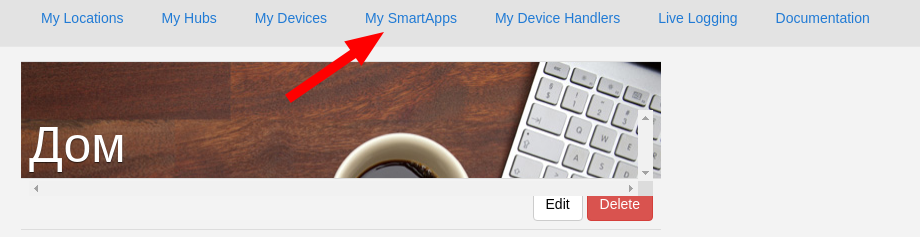
4. add a new smartapp from [smartapps/intercom-ctrl.groovy](./smartapps/intercom-ctrl.groovy) 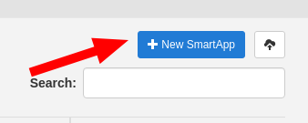 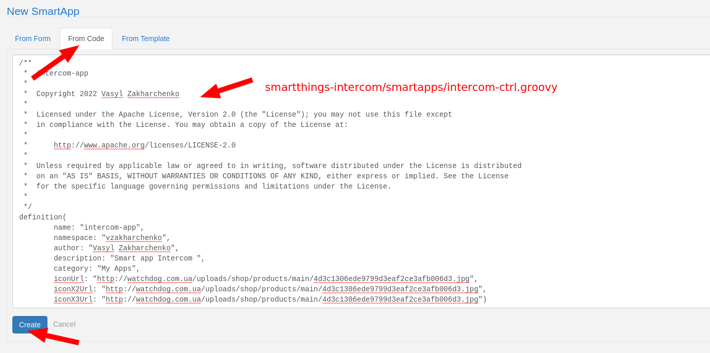
5. enable oauth 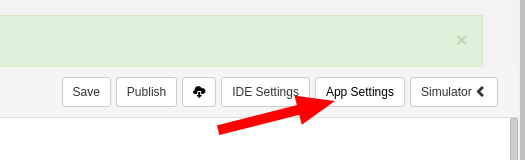 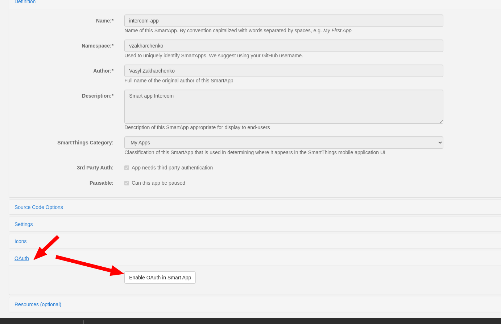
6. publish "For Me" 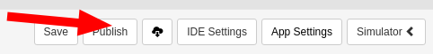

## added smartapp to your location

1. [Install Server](./server/README.md)
2. open [https://my.smartthings.com/](https://my.smartthings.com/)
3. add "Groovy SmartApp" 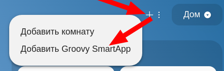
4. add "Intercom App" 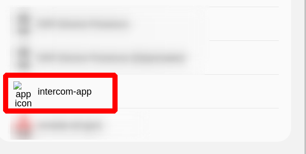 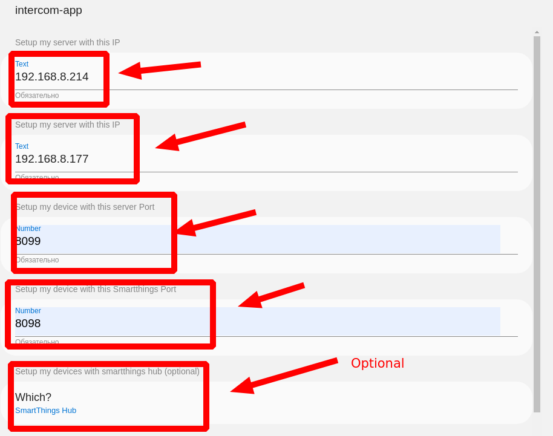

## How to Get Application Id and Secret

1. open [https://my.smartthings.com/](https://my.smartthings.com/)
2. select Automations 
3. select intercom app 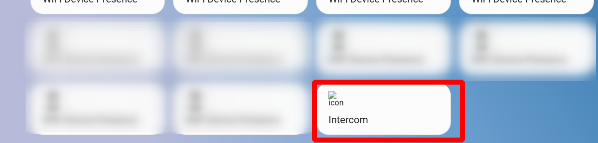
4.  "Server Info" 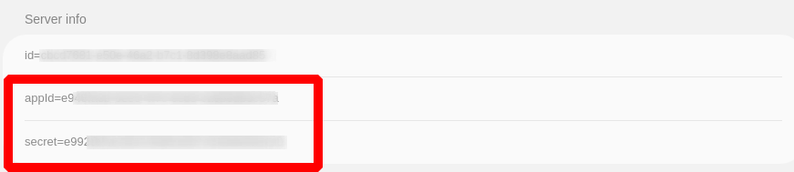
